### State Diagrams

#### State Diagram for the `greatday start` Command

The following diagram is kicked off when a user runs the `greatday start`
command. We assume that it has been `N` days since your tickler Todos were last
processed:

#### State Diagram for Processing Todos

### Class Diagrams

This section contains class diagrams used to help design / document greatday.

#### Class Diagram for `Todo` Classes

The following diagram illustrates how the various [magodo][1] `Todo` classes
interact.

Keep in mind the following notes while reviewing this diagram:

* The type variable `Self` is implicit and is always bound by the current class.
* The type variable `T` is bound by the `AbstractTodo` protocol.

#### Class Diagram for `Repo` and `UnitOfWork` Classes

The following diagram illustrates how the various [potoroo][2] `Repo` and `UnitOfWork`
classes interact.

Keep in mind the following notes while reviewing this diagram:

* `V_or_None` is meant to be `Optional[V]`. There seems to be a bug in
  [mermaid][3], however, that prevents us from using `Optional[V]` as a generic
  type.
* Similarly, `VList` is meant to be `List[V]`.
* The type variable `Self` is implicit and is always bound by the current class.
* The type variable `R` is bound by the `BasicRepo` class.
* The type variables `K`, `V`, and `T` are all unbound.

[1]: https://github.com/bbugyi200/magodo
[2]: https://github.com/bbugyi200/potoroo
[3]: https://github.com/mermaid-js/mermaid
