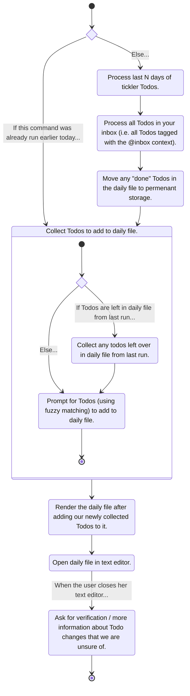

### State Diagram for the `greatday start` Command

The following diagram is kicked off when a user runs the `greatday start`
command. We assume that it has been `N` days since your tickler Todos were last
processed:

